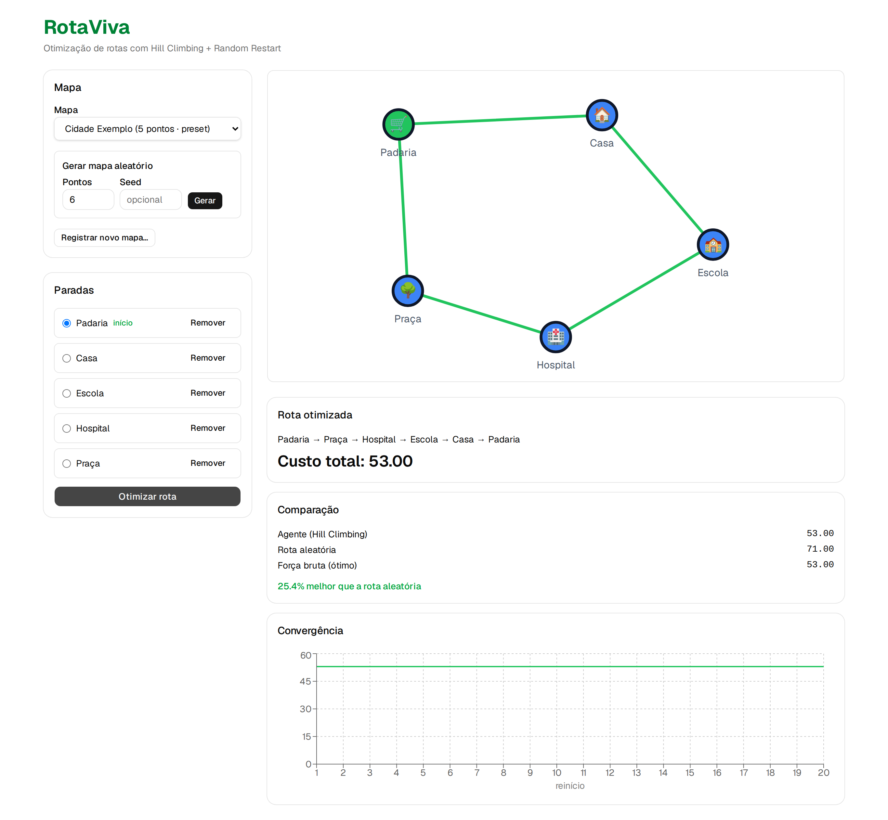
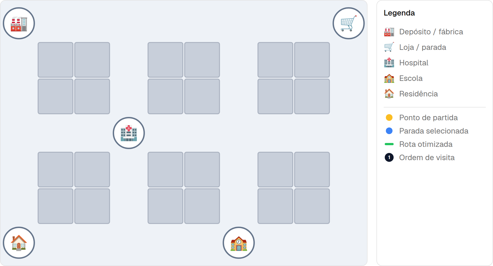
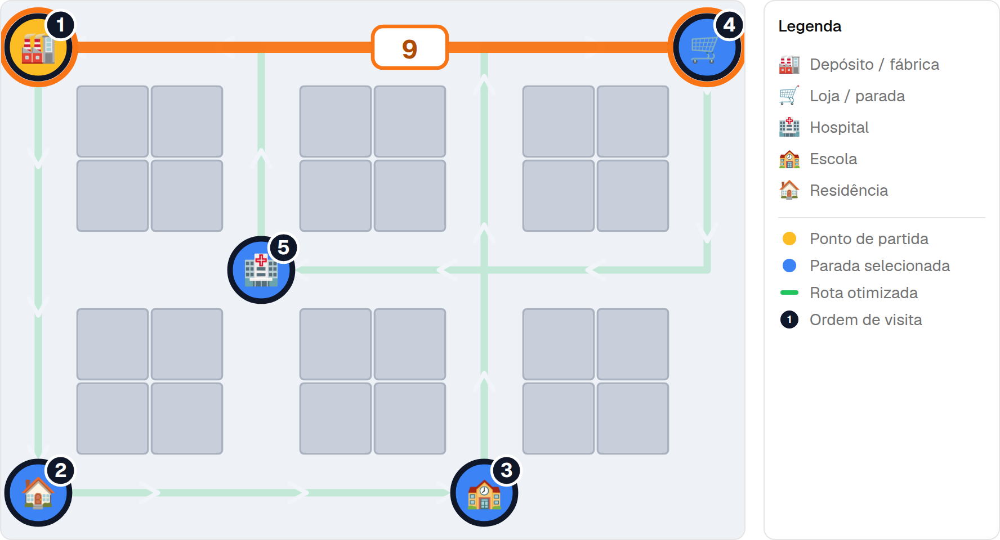
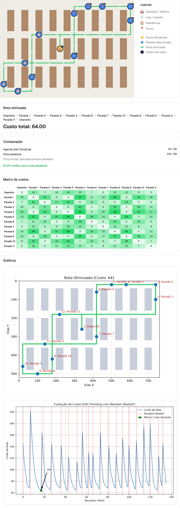
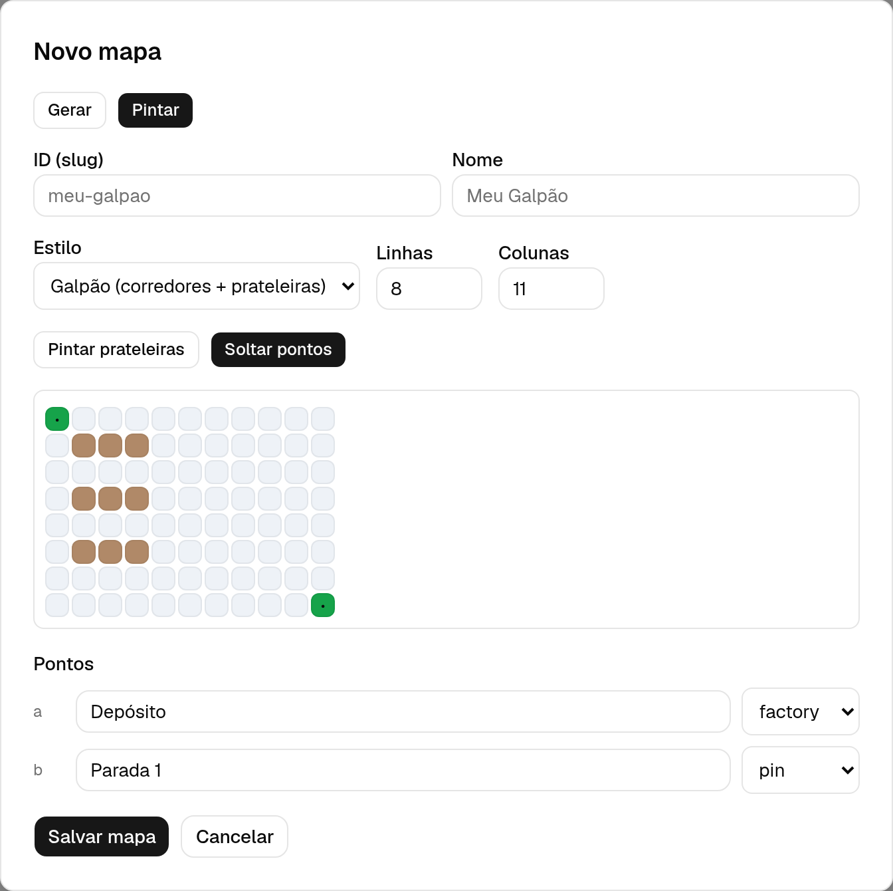

# RotaViva

**Sistema Inteligente de Otimização de Rotas** — a self-contained web app that finds the best
**round-trip route** (a Traveling Salesman tour) across a **grid map of streets and aisles**, using a
**goal-based agent** running **Hill Climbing with Random Restart**. It then visualizes the route
following the streets and benchmarks the agent against a random baseline and an exact brute-force optimum.

Each map is a **grid** where blocked cells (buildings or warehouse shelves) **genuinely block movement** —
travel happens only along the free cells (streets/aisles), so distances are **shortest paths around the
obstacles**, not straight lines. The same grid model renders in two styles: **city** (buildings + roads)
and **warehouse** (shelf racks + aisles). There is **no real map, geocoding, or external routing API** —
the grid is in-app data, so the focus stays on the AI/optimization logic.

> v0.1 — a modern web rebuild of the original RotaViva concept (a ~200-line Python/NetworkX/Matplotlib
> script), preserving the AI intent: local search over a city graph, measured against baselines.



---

## Table of contents

- [What it does](#what-it-does)
- [Features](#features)
- [Screenshots](#screenshots)
- [How it works (the algorithm)](#how-it-works-the-algorithm)
- [Architecture](#architecture)
- [Project structure](#project-structure)
- [Getting started](#getting-started)
- [Configuration](#configuration)
- [API reference](#api-reference)
- [Module reference](#module-reference)
- [Testing](#testing)
- [Roadmap (v0.2)](#roadmap-v02)

---

## What it does

1. You pick a **map** — a bundled preset (a city or a warehouse), one you painted yourself, or a randomly generated grid.
2. You click points on the grid to choose a **subset of stops** and designate a **start**.
3. The backend derives the distance sub-matrix for those stops (shortest paths along the streets) and runs the **agent**:
   Hill Climbing over a **2-opt** neighborhood, with **Random Restart** to escape local optima,
   and a **memory of visited states** so no tour is evaluated twice in a run.
4. The frontend draws the resulting **closed round-trip** on the map — with a **visiting-order badge**
   on each stop, a **gold start marker**, and an **icon legend** — and shows:
   - the **route sequence** and its **total cost**,
   - a **three-way comparison**: agent vs. a random route vs. the **brute-force optimum**
     (computed only for small instances, `N < 10`),
   - the **cost matrix** for the chosen stops,
   - two **server-rendered charts** (matplotlib PNGs): the **route** following the streets and the full
     **cost-evolution sawtooth** across all restarts.
5. Every optimization is **persisted** (SQLite) with a generated `run_id`, so past runs can be **listed
   and reopened** from the history panel.

RotaViva solves the **Traveling Salesman Problem (TSP)** — visiting every chosen stop exactly once
and returning to the start at minimum total distance. TSP is NP-hard, so for anything but tiny
instances an exact search is intractable; the agent trades guaranteed optimality for a good solution
in a fraction of the time, and the UI lets you *see* how close it gets.

## Features

- **Grid maps in two styles** — **city** (buildings + roads) and **warehouse** (shelf racks + aisles); blocked cells block movement, so distances are shortest paths *around* them.
- **Goal-based agent**: Hill Climbing + Random Restart over a 2-opt neighborhood, deterministic under a seed.
- **Visited-state memory** ("memória de estados") — identical tours are never re-evaluated within a run.
- **Three-way benchmark**: agent route vs. random route vs. exact brute force (guarded to `N < 10`).
- **Server-rendered charts** (matplotlib PNGs): the **route** along the streets (same green scale, with the meaningless pixel axes removed) and the full **cost-evolution sawtooth** with restart markers and the global-minimum annotation.
- **Street-following route** drawn as a **green scale** (light at the start → dark at the end) with `>` direction arrows along the path, so travel direction is easy to read.
- **Order badges & gold start** — after optimizing, each stop shows its visiting order and the start is marked gold.
- **Icon legend** beside the map explaining each sprite and the marker conventions (start / selected / route / order).
- **Interactive cost matrix** for the selected stops (color-scaled table, shown above the benchmark comparison) — hovering a cell highlights that leg's street path and cost on the map.
- **Persisted run history** — every optimization is saved to SQLite with an id; browse past runs and reopen any one (route + evolution charts + matrix) from the history panel.
- **Unified "Novo mapa" dialog** — a single modal creates maps two ways via a **Gerar / Pintar** toggle: procedurally generate (style · size · density · points · seed) or hand-paint a grid. All generation inputs live inside the dialog, not the sidebar.
- **Three map sources**: bundled **presets** (one city, one warehouse), **user-painted** maps, and
  **auto-generated** city/warehouse grids (style + size + density + seed).
- **Built-in grid painter** — paint buildings/shelves, drop points on free cells, pick a style; the
  distance matrix is **derived from the layout** (4-connected shortest paths).
- Clean separation: a **pure, fully unit-tested** algorithm core (74 backend tests) behind a thin HTTP API.

## Screenshots

### Map view — a city grid
A city preset: building blocks separated by a street grid, with sprite points sitting on the streets.
Click any point to add it as a stop.



### Optimized round-trip + benchmark
The agent's closed route drawn as a **green scale** (light start → dark end), **following the streets at right angles around the buildings**,
with small `>` arrows marking the direction of travel and a **numbered badge** on each stop showing the
visiting order (the **gold** marker is the start). The legend at the right explains the icons. Below the
map: the route sequence and total cost, the **cost matrix**, the agent-vs-random-vs-brute-force
comparison, and the two **server-rendered charts** (route + cost-evolution sawtooth).


### Interactive cost matrix
Hover any cell of the cost matrix and the map highlights that A→B leg in orange — the **street path**
plus a **cost badge** at its midpoint — while the optimized route dims behind it. The matrix sits
directly under the route, above the benchmark comparison.



### Generated warehouse — where brute force gives up
An auto-generated warehouse with 12 stops. Brute force is skipped ("ignorada"), but the agent still
finds a route ~50% better than a random one — the core value of the heuristic. The path runs down the
**aisles, around the shelf racks**.



### New-map dialog — generate or paint
The **Novo mapa** dialog (opened from the sidebar button) creates a map two ways via a **Gerar / Pintar**
toggle: *Gerar* procedurally builds a city/warehouse grid (style · size · density · points · seed), while
*Pintar* (shown here) lets you **click and drag** to paint buildings/shelves and drop stops on the free
cells (point icons are labeled in pt-BR), and step back one edit at a time with **Desfazer** (undo).
Either way the
distance matrix is **derived from the layout** (4-connected shortest paths) — no hand-edited numbers. All
generation inputs live inside this dialog.



---

## How it works (the algorithm)

The optimization core lives in `backend/app/routing/` and is **pure** (no I/O) and **deterministic**
under a provided `seed`. It operates only on integer-indexed distance matrices — the HTTP layer maps
point ids ↔ matrix indices.

### Distances from the grid (BFS)
Distances are **not** straight-line. Each map carries a grid of cells — `.` is free (street/aisle),
`#` is blocked (building/shelf). The distance between two points is the length of the **shortest
4-connected path** over free cells (a breadth-first search), in **whole street steps** (one move
between adjacent cells costs `1`). Two points that are close as the crow flies but walled off become
genuinely far. The backend derives the full symmetric matrix from the grid via BFS and feeds it to the
optimizer; the frontend runs the same BFS to draw each route leg, so the drawn path is always exactly
as long as the cost the agent used. Buildings/shelves thus impose **real** constraints, and tour costs
are integers (step counts).

### Tour & cost
A **tour** is a list of stop indices forming a closed cycle, with the start fixed at position `0`.
The **cost** is the sum of the directed edges around the loop, *including* the closing edge back to
the start:

```
cost(tour) = Σ  matrix[tour[i]][tour[(i+1) mod n]]
```

Using directed edges and the modulo wrap means the same function works for **symmetric and asymmetric**
matrices and degenerate cases (1 or 2 stops).

### 2-opt neighborhood
A neighbor of a tour is produced by a **2-opt move**: reverse the contiguous segment between two
positions `i` and `j` (`1 ≤ i < j < n`). Position `0` is never moved, so the start stays fixed and
every neighbor is a valid permutation. This yields `(n-1)(n-2)/2` neighbors per tour.

### Local search (best-improving)
From a starting tour, evaluate all neighbors and move to the **strictly best-improving** one; repeat
until no neighbor improves (a **local optimum**). Cost strictly decreases on every accepted move, so
the search always terminates.

### Random Restart
A single hill climb gets stuck at the first local optimum it reaches. **Random Restart** runs local
search from several **seeded random** initial tours and keeps the best result across all of them —
dramatically improving solution quality on multi-optimum instances.

### Visited-state memory
A run-wide `set` of canonical tour keys records every tour already evaluated. Neighbors whose key was
already seen are skipped, so **no identical tour is ever evaluated twice within a run** — this is the
concept doc's "memória de estados", shared across all restarts.

### Convergence history
The optimizer records the **full search trace**: every accepted-move cost across all restarts
(`full_history`) plus the index in that trace where each restart begins (`restart_indices`).
Concatenated, these form the **sawtooth** the evolution chart renders — each restart descends from a
fresh random tour, then jumps back up at the next restart — with the global minimum annotated. The
chart is rendered **server-side** as a matplotlib PNG from the persisted run.

### Baselines (for benchmarking)
- **Random route cost** — the cost of one random valid tour (seeded): the "no intelligence" baseline.
- **Brute-force optimal** — the exact minimum over all permutations, **guarded** to `N < BRUTE_FORCE_GUARD`
  (default `10`). Above the guard it is skipped and the response flags `brute_force_skipped: true`.

### From ids to a sub-matrix (the API glue)
On `POST /optimize` the route layer:
1. derives the full distance matrix from the map's grid (4-connected BFS) and maps each point id → its matrix index,
2. orders the chosen stops as `[start] + others` and builds the `N×N` sub-matrix over those indices,
3. runs `hill_climb` (start fixed at index `0`), computes both baselines,
4. maps the resulting index tour back to point ids and appends the start to close the loop,
5. **persists the run** as a self-contained snapshot (stops, costs, sub-matrix, full search trace, and a
   grid snapshot) to SQLite and returns its `run_id`; the route, edge-cost, and evolution PNGs are
   rendered **on demand** from that snapshot by the chart endpoints, so they survive even if the source
   map is later deleted.

## Architecture

Two independently runnable deployables that talk over HTTP/JSON:

```
┌────────────────────────────┐      HTTP / JSON       ┌────────────────────────────────┐
│  Frontend (Vite + React)    │ ─────────────────────▶ │  Backend (FastAPI)              │
│  • map picker + dialog       │  /maps /optimize /runs  │  • api/       thin HTTP layer   │
│  • SVG canvas + route        │ ◀───────────────────── │  • routing/   pure TSP core ★   │
│  • matrix + PNG charts       │   run_id, cost, matrix, │  • charts.py  matplotlib PNGs   │
│  • results + run history     │   baselines, PNG bytes  │  • maps/ grid · runs/ sqlite    │
└────────────────────────────┘                        └────────────────────────────────┘
                                                          ★ no I/O, deterministic, unit-tested
```

- `routing/` (the algorithm) never imports `maps/` or `api/`.
- `maps/store.py` is the **only** module that touches the filesystem.
- `api/` does validation, id↔index mapping, and exception→HTTP translation — no business logic.

## Project structure

```
rotaviva/
├── backend/
│   ├── app/
│   │   ├── config.py              # env-driven settings (guards, defaults, dirs, runs.db)
│   │   ├── main.py                # FastAPI app factory + CORS
│   │   ├── charts.py              # matplotlib route + edge-cost + evolution PNGs (OO API, thread-safe)
│   │   ├── api/
│   │   │   ├── schemas.py         # Pydantic models (maps, optimize, runs)
│   │   │   └── routes.py          # 12 endpoints; id↔index mapping; error mapping
│   │   ├── routing/               # PURE core — no I/O, deterministic, unit-tested
│   │   │   ├── tour.py            # Tour type + tour_cost()
│   │   │   ├── hill_climbing.py   # 2-opt, local search, random restart, memory, full trace
│   │   │   └── baselines.py       # random + guarded brute-force baselines
│   │   ├── maps/
│   │   │   ├── grid.py            # grid model: BFS distances/paths, matrix derivation, connectivity
│   │   │   ├── store.py           # JSON store: presets (read-only) + user CRUD + grid validation
│   │   │   ├── generate.py        # procedural city/warehouse grid layouts (seeded)
│   │   │   └── presets/*.json     # bundled grids (centro, galpao-central)
│   │   └── runs/
│   │       └── store.py           # SQLite store of optimization runs (self-contained snapshots)
│   ├── tests/                     # 74 pytest tests: core, grid, charts, store, runs, API
│   └── pyproject.toml             # uv project (FastAPI · pydantic · numpy · matplotlib)
├── frontend/
│   ├── src/
│   │   ├── types.ts               # shared TS types (maps, optimize, runs) mirroring Pydantic
│   │   ├── lib/api.ts             # typed fetch wrappers + chart PNG URL helpers
│   │   ├── lib/grid.ts            # cell-center + 4-connected BFS for drawing routes
│   │   ├── lib/sprites.ts         # shared sprite emoji + labels
│   │   ├── components/
│   │   │   ├── MapCanvas.tsx       # SVG grid, route, order badges, gold start, direction chevrons
│   │   │   ├── MapLegend.tsx       # icon + marker-convention legend beside the canvas
│   │   │   ├── StopList.tsx        # selected stops, designate start, remove
│   │   │   ├── MapPicker.tsx       # choose / delete a map; opens the Novo mapa dialog
│   │   │   ├── MapGenerator.tsx    # procedural generation form (lives in the Novo mapa dialog)
│   │   │   ├── GridPainter.tsx     # paint buildings/shelves, drop points; matrix derived
│   │   │   ├── ResultsPanel.tsx    # route, cost, comparison, cost matrix, PNG charts
│   │   │   ├── CostMatrix.tsx      # color-scaled distance-matrix table
│   │   │   ├── RunsList.tsx        # past-optimization history list
│   │   │   ├── RunDetail.tsx       # read-only run detail (map view + matrix + charts)
│   │   │   └── ui/                 # shadcn/ui primitives (button, card, dialog, …)
│   │   └── App.tsx                # state owner + layout (map, stops, result, runs, dialogs)
│   └── package.json               # pnpm project (Vite + React + Tailwind v4)
├── docs/
│   └── screenshots/               # the images used in this README
└── README.md
```

## Getting started

### Prerequisites
- **Python 3.11+** and [**uv**](https://docs.astral.sh/uv/) (env + dependency manager)
- **Node 20+** and [**pnpm**](https://pnpm.io/)

### 1. Backend (FastAPI, port 8000)

```bash
cd backend
uv sync                                              # create venv + install deps
uv run uvicorn app.main:app --reload --port 8000     # start the API
```

- Interactive API docs: <http://localhost:8000/docs>
- Run the test suite: `uv run pytest`

### 2. Frontend (Vite + React, port 5173)

```bash
cd frontend
pnpm install
pnpm dev                                             # http://localhost:5173
```

Open <http://localhost:5173>, pick **Centro**, click a few points, set a start, and hit
**Otimizar rota**. Production build: `pnpm build` (outputs to `frontend/dist`).

> The frontend calls the backend at `http://localhost:8000` by default — start the backend first.
> The backend's CORS is preconfigured for the Vite dev server origin.

> **Troubleshooting:** if `node`/`pnpm` aren't found via a version manager (e.g. a broken asdf shim),
> point your shell at a concrete Node install, e.g.
> `export PATH="$HOME/.asdf/installs/nodejs/22.12.0/bin:$PATH"`.

## Configuration

### Backend (environment variables, prefix `ROTAVIVA_`)
| Variable | Default | Meaning |
|---|---|---|
| `ROTAVIVA_PRESETS_DIR` | `app/maps/presets` | Read-only bundled maps |
| `ROTAVIVA_DATA_DIR` | `backend/data/maps` | Where user-registered maps are written (gitignored) |
| `ROTAVIVA_RUNS_DB` | `backend/data/runs.db` | SQLite database of optimization runs (gitignored) |
| `ROTAVIVA_BRUTE_FORCE_GUARD` | `10` | Brute force is skipped when `N ≥ this` |
| `ROTAVIVA_DEFAULT_RESTARTS` | `20` | Random-restart count when the request omits it |

### Frontend
| Variable | Default | Meaning |
|---|---|---|
| `VITE_API_URL` | `http://localhost:8000` | Backend base URL |

## API reference

| Method | Path | Purpose |
|--------|------|---------|
| `GET`  | `/maps` | List all maps (presets + user), summary form |
| `GET`  | `/maps/{id}` | Full map (style + grid + points) |
| `POST` | `/maps` | Register a painted map (style + grid + points; matrix derived) → `201` |
| `DELETE` | `/maps/{id}` | Delete a user map (presets are read-only) → `204` |
| `POST` | `/maps/generate` | Generate a city/warehouse grid (style·size·density·n·seed); optionally save |
| `POST` | `/optimize` | Run the agent + baselines for a map/subset; **persists a run** and returns its `run_id` + cost matrix |
| `GET`  | `/runs` | List past optimization runs (newest first, summary form) |
| `GET`  | `/runs/{id}` | Full run detail (tour, costs, baselines, cost matrix, params) + a self-contained **map snapshot** (the run's stops) for the detail map view |
| `DELETE` | `/runs/{id}` | Delete a run → `204` |
| `GET`  | `/runs/{id}/route.png` | Route chart (PNG) rendered from the run snapshot |
| `GET`  | `/runs/{id}/route_costs.png` | Clean node-and-edge graph (no walls) with each leg's cost labeled on its edge (PNG) |
| `GET`  | `/runs/{id}/evolution.png` | Cost-evolution chart (PNG) rendered from the run snapshot |

**Example — optimize a route:**

```bash
curl -s -X POST http://localhost:8000/optimize \
  -H 'content-type: application/json' \
  -d '{"map_id":"centro","stop_ids":["a","b","c","d","e"],"start_id":"a","seed":5}'
```

```jsonc
{
  "run_id": 1,                               // persisted run; charts live at /runs/1/*.png
  "tour": ["a", "b", "d", "e", "c", "a"],   // ordered ids, closed loop
  "total_cost": 36.0,                        // whole street steps
  "matrix": [[0, 7, ...], ...],             // N×N sub-matrix for the chosen stops
  "stop_order": ["a", "b", "c", "d", "e"],  // start first, then the rest
  "stop_labels": ["Depósito", "Mercado", "Hospital", "Escola", "Casa"],
  "baselines": { "random_cost": 42.0, "brute_force_cost": 36.0 },
  "brute_force_skipped": false
}
```

The full search trace (the sawtooth) is not returned inline — it is stored with the run and rendered
server-side at `GET /runs/{id}/evolution.png`.

**Error semantics:** a point on a blocked cell, a disconnected grid (points walled off from each
other), or a ragged/invalid grid → `422`; `start_id` not in `stop_ids` or fewer than 2 stops → `422`;
id/name collision on register → `409`; deleting a preset → `403`; unknown map → `404`. Brute force
above the guard is **not** an error — it's skipped with `brute_force_skipped: true`.

## Module reference

### Backend

| Module | Responsibility | Key surface |
|---|---|---|
| `app/routing/tour.py` | Tour representation + cost of a closed cycle | `tour_cost(matrix, tour)` |
| `app/routing/hill_climbing.py` | The agent: neighborhood, local search, restarts, memory; emits the full search trace | `two_opt_neighbors`, `random_tour`, `local_search`, `hill_climb` → `HillClimbResult(best_tour, best_cost, full_history, restart_indices)` |
| `app/routing/baselines.py` | Benchmark baselines | `random_route_cost`, `brute_force_optimal` |
| `app/charts.py` | Server-side chart rendering (matplotlib OO API, thread-safe) → PNG bytes | `route_png`, `route_costs_png`, `evolution_png` |
| `app/maps/grid.py` | Grid model (pure): 4-connected BFS distances + shortest **paths**, matrix derivation, connectivity, cell↔pixel | `parse_grid`, `bfs_distances`, `bfs_path`, `derive_matrix`, `validate_points`, `matrix_for_map`, `cell_center` |
| `app/maps/store.py` | The only filesystem module: load presets (read-only) + user CRUD; grid + connectivity validation; no stored matrix | `validate_map`, `list_maps`, `get_map`, `create_map`, `delete_map`, `MapError`+subclasses |
| `app/maps/generate.py` | Procedural seeded city/warehouse grid layouts (always connected, n points on free cells) | `generate_map(map_id, name, n, *, style, size, density, seed)` |
| `app/runs/store.py` | SQLite persistence of optimization runs (self-contained snapshots) | `record_run`, `get_run`, `list_runs`, `delete_run`, `RunNotFound` |
| `app/api/schemas.py` | Pydantic models (mirror `frontend/src/types.ts`); `OptimizeResponse` carries `run_id` + `matrix` (no `history`) | `MapModel`, `GenerateRequest`, `OptimizeResponse`, `RunSummary`, `RunDetail` |
| `app/api/routes.py` | Thin HTTP layer: validation, id↔index mapping, run persistence, store/run-exception → HTTP code | the 12 endpoints |
| `app/config.py` | Env-driven settings (no caching, so tests can redirect dirs/db) | `Settings`, `get_settings()` |

### Frontend

| Module | Responsibility |
|---|---|
| `src/App.tsx` | Owns all state (maps, selected map, stops, start, result, runs, dialogs) and the layout; wires every component and the API |
| `src/lib/api.ts` | Typed `fetch` wrappers for the map/optimize/run endpoints + chart-PNG URL helpers; extracts FastAPI error `detail` |
| `src/lib/grid.ts` | Pure helpers mirroring the backend grid contract: `cellCenter`, `isFree`, `bfsPath` (shortest cell path used to draw route legs) |
| `src/lib/sprites.ts` | Shared sprite metadata: `SPRITE_EMOJI`, `SPRITE_LABELS`, `SPRITES` (used by canvas, painter, legend) |
| `src/types.ts` | Shared TypeScript types mirroring the backend Pydantic schemas (`Cell`, `GridModel`, `style`, `OptimizeResponse`, `RunSummary`, `RunDetail`) |
| `src/components/MapCanvas.tsx` | SVG canvas: themed grid, sprite points, click-to-toggle stops, the street-following **green-scale** route (BFS, light→dark = direction) with `>` direction chevrons, **visiting-order badges**, a **gold** start marker, and the **hovered cost-matrix leg** (orange path + cost badge) |
| `src/components/MapLegend.tsx` | Legend beside the canvas: each map sprite + meaning, and the marker/route conventions |
| `src/components/StopList.tsx` | Lists selected stops, radio to designate the start, remove button |
| `src/components/MapPicker.tsx` | Dropdown of maps, delete (non-presets), and the **Novo mapa** button that opens the creation dialog |
| `src/components/MapGenerator.tsx` | Procedural-generation form (style · size · density · points · seed); lives inside the Novo mapa dialog (Gerar mode) |
| `src/components/GridPainter.tsx` | Click-drag to paint buildings/shelves, drop points on free cells (icons labeled in pt-BR), pick a style, step back edits with Desfazer (undo); validates connectivity and posts a grid map (matrix derived server-side); the Novo mapa dialog's Pintar mode |
| `src/components/ResultsPanel.tsx` | Route sequence, total cost, agent/random/brute-force comparison, improvement %, the **cost matrix**, and the route + edge-cost + evolution **PNG charts** |
| `src/components/CostMatrix.tsx` | Color-scaled HTML table of the stop-to-stop distance matrix; emits hover events so the map can highlight that leg |
| `src/components/RunsList.tsx` | History of past optimizations (newest first); open or delete a run |
| `src/components/RunDetail.tsx` | Read-only detail of a saved run: interactive **map view** (route, badges, gold start, and the same cost-matrix hover highlight) first, then summary, cost matrix, and route + edge-cost + evolution PNGs |

## Testing

The pure `routing/` core is exhaustively unit-tested (deterministic via seed), plus the store and the
HTTP API:

```bash
cd backend && uv run pytest        # 74 tests
```

Coverage highlights: cost correctness (symmetric + asymmetric), 2-opt validity, local-search
monotonicity, the circle instance whose optimum is the angular order, determinism under a seed,
visited-state memory (no tour evaluated twice), the **full search trace** (sawtooth + restart markers,
`min(full_history) == best_cost`), brute force matching the known optimum + the guard refusing large N,
edge cases (1/2/3 stops); **grid BFS distances + shortest paths that detour around walls**,
**matrix derivation + connectivity rejection**, deterministic city/warehouse **generation**, the full
map-store CRUD + grid validation, the **run store** roundtrip/list/delete, **chart renderers** emitting
valid PNG bytes, and every endpoint — including the run detail + chart endpoints — through FastAPI's
`TestClient`. The frontend is exercised manually for v0.1.

## Roadmap (v0.2)

Deferred from the v0.1 concept doc: **Simulated Annealing** as an alternative heuristic, a **Naive
Bayes** congestion model to adjust edge costs, real-map visual input, **multi-agent fleets** with
route division, and cross-run persistent learning.
